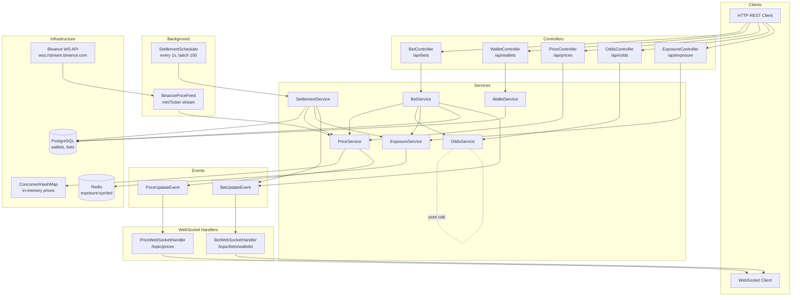
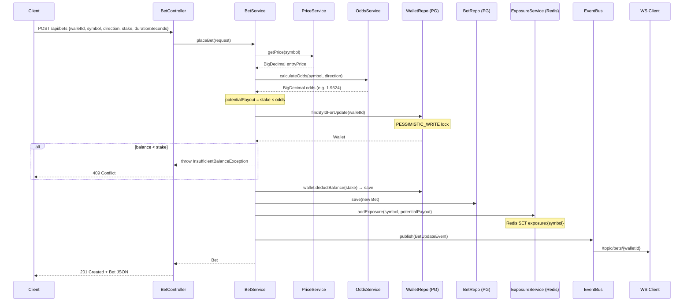
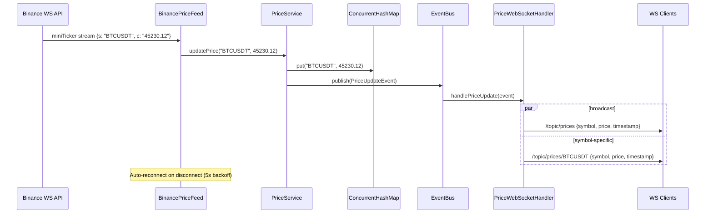
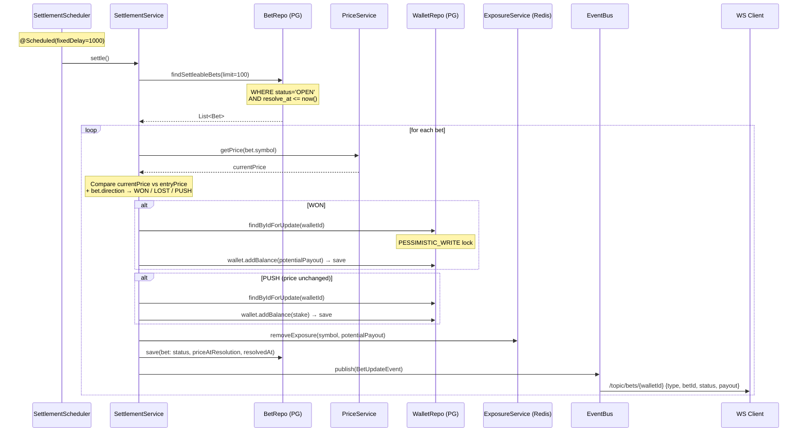
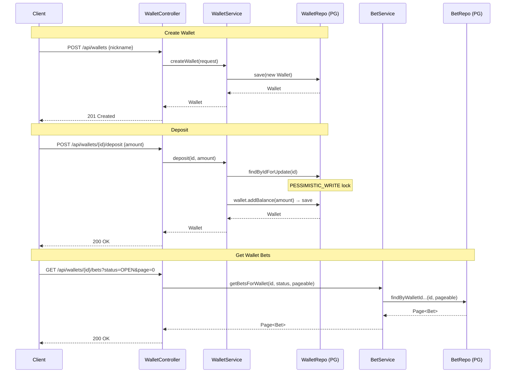

# Swim Lane Diagrams — Crypto Bet Engine

## Component Overview

## Flow 1: Place Bet

## Flow 2: Price Update (Binance → Clients)

## Flow 3: Settlement (Background Job)

## Flow 4: Wallet Operations

## Infrastructure Summary

| Component | Technology | Purpose |
|-----------|-----------|---------|
| Database | PostgreSQL 16 | Wallets, Bets (persistent state) |
| Cache/State | Redis 7 | Exposure tracking per symbol |
| Prices | In-memory ConcurrentHashMap | Live price feed (ephemeral) |
| Events | Spring ApplicationEventPublisher | In-JVM event bus |
| Real-time | WebSocket + STOMP | Push prices & bet updates to clients |
| External | Binance WebSocket API | Live crypto price feed |
| Scheduling | Spring @Scheduled | Settlement every 1s |
| Concurrency | Pessimistic DB locks + Virtual Threads (Java 21) | Safe wallet mutations |
